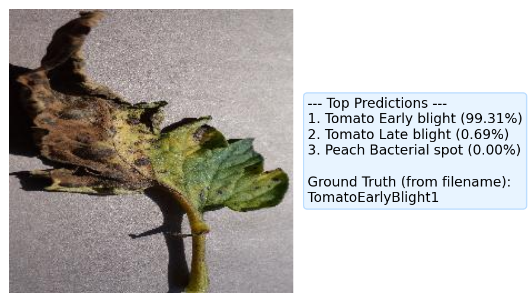
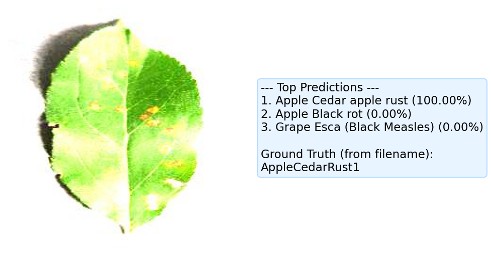
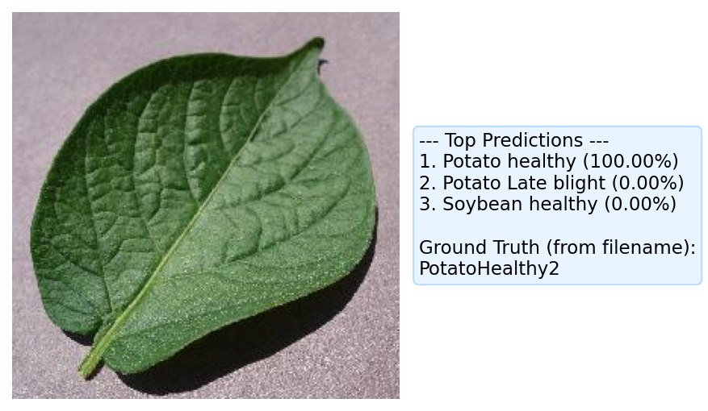

# 🍃 Plant Disease Classifier: AI for Agriculture

Hey there! Welcome to my Plant Disease Classifier project. 👋

In this project, I built a custom **Convolutional Neural Network (CNN)** completely from scratch using PyTorch. The goal? To look at a picture of a plant leaf and instantly diagnose if it's healthy or suffering from one of 38 different diseases! 

After pushing the architecture to its mathematical limits with rigorous L2 regularization and dynamic learning rate scheduling (`ReduceLROnPlateau`), the final 100-epoch model achieved a massive **98.72% accuracy** on unseen test data! 🚀

## 📸 See It In Action!
Here is the model running inference on completely unseen images. Notice the incredible confidence levels!







## 🛠️ The Tech Stack & Features
- **The Brain**: A highly optimized Custom CNN designed for 224x224 RGB images. No pre-trained weights here—it learned everything from scratch!
- **Combating Overfitting**: I implemented aggressive L2 Weight Decay (`1e-4`) to make sure the model generalized beautifully to new data.
- **Smart Training**: PyTorch's `ReduceLROnPlateau` scheduler was used to dynamically drop the learning rate when validation loss stalled, forcing the model to find the absolute minimum loss.
- **MLOps Dashboard**: The entire training pipeline is integrated with **Weights & Biases (wandb)** for live, professional tracking of loss curves and system metrics.

## 📂 Project Anatomy
- `src/`: The core engine! Contains the data loading pipeline (`dataset.py`), the mathematical architecture (`model.py`), and the training loop (`train.py`).
- `configs/`: Clean YAML files where I set the hyperparameters for my various experiments.
- `scripts/`: Production-ready bash scripts to fire off training runs on specific GPUs.
- `notebooks/`: Jupyter Notebooks where I do exploratory data analysis and visual evaluations.
- `assets/`: Image assets for this README.

## 🚀 Want to run it yourself?

**1. Set up your environment:**
You'll need a conda environment with `pytorch`, `torchvision`, and `wandb`. 

**2. Train the beast:**
Jump into the terminal and fire off one of the bash scripts. Make sure your GPU is ready!
```bash
./scripts/run_train_exp4.sh
```

**3. Test its knowledge:**
Fire up the `notebooks/evaluate.ipynb` notebook, load in the `.pth` weights, and test it on your own leaf pictures!

---
*Built with ❤️ to push the boundaries of Agricultural Computer Vision.*
